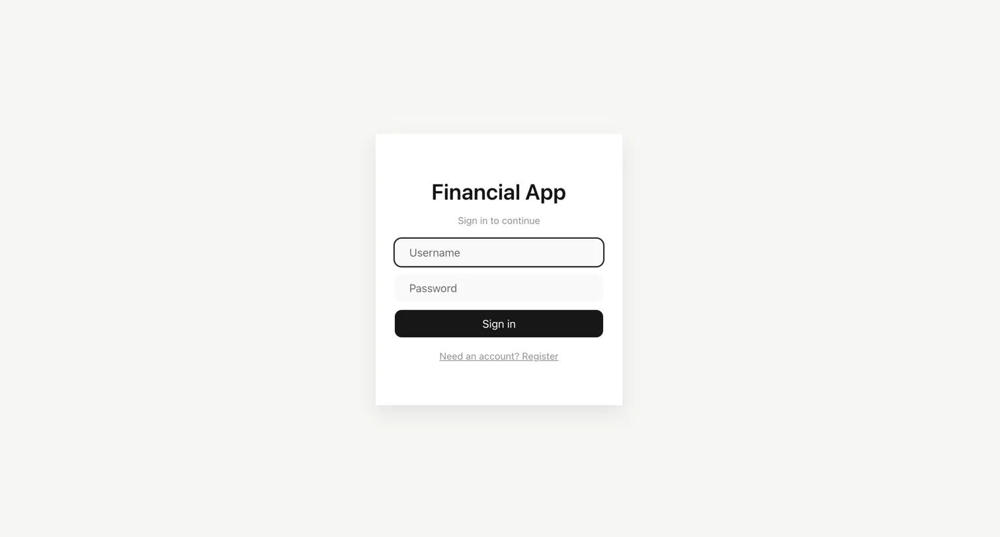
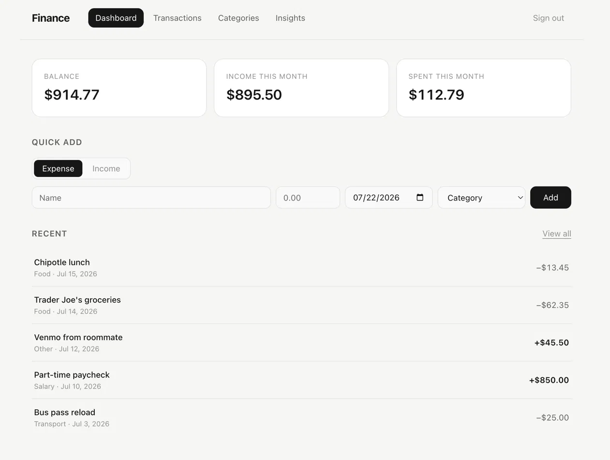
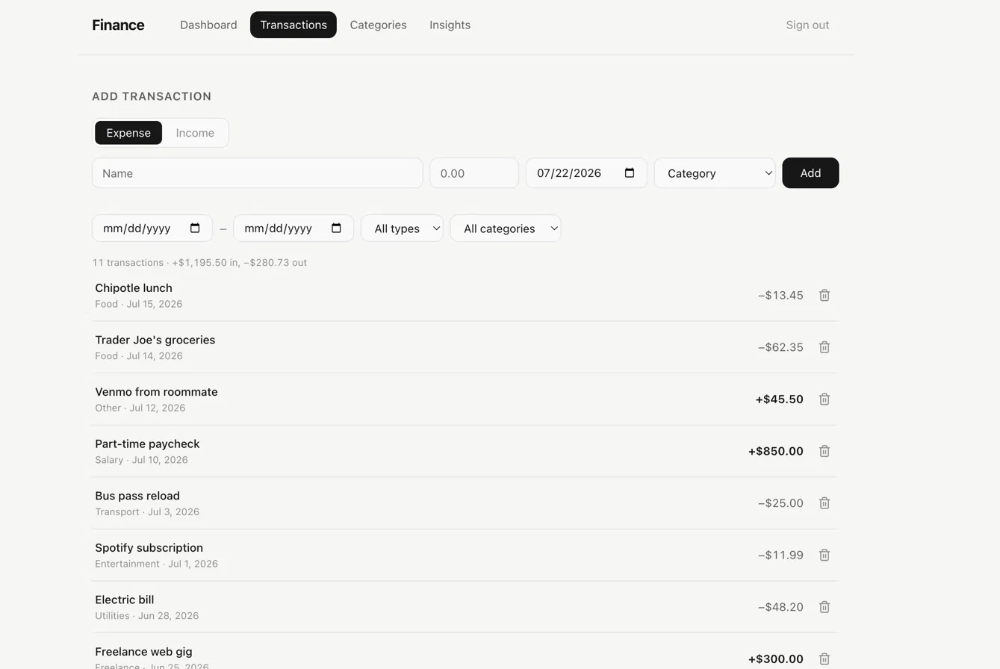
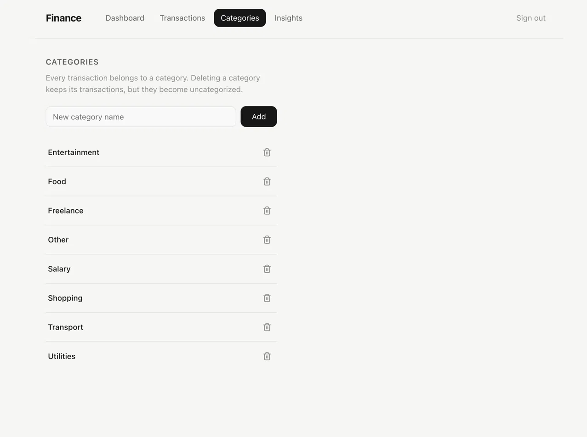
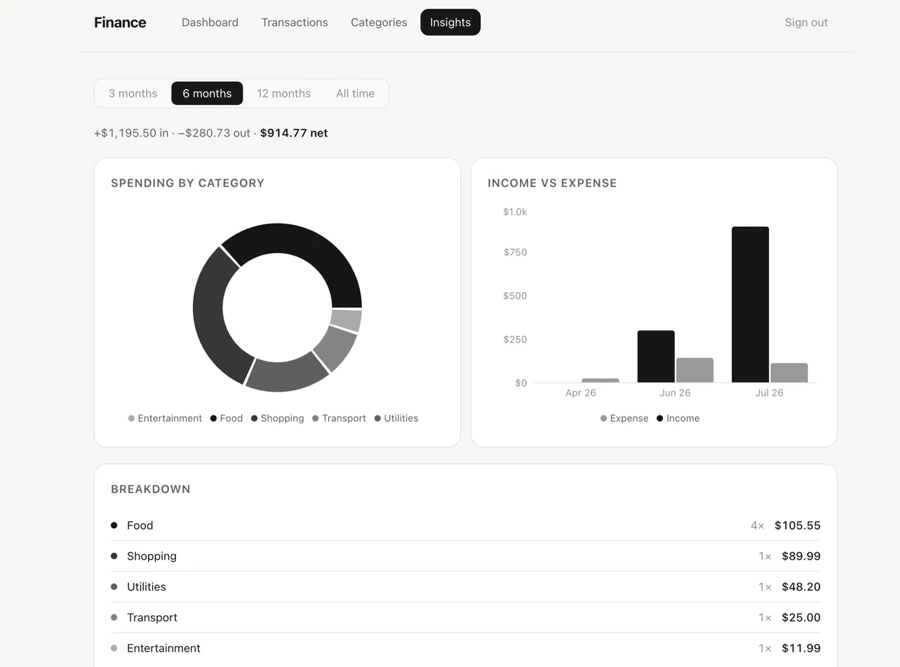

# Finance

A personal finance web app to track income and expenses, manage categories, and visualize spending patterns.

Built with FastAPI + React.

---

## Screenshots

### Login


### Dashboard


### Transactions


### Categories


### Insights


---

## Features

- **JWT Authentication** — Secure login and registration with token-based auth and auto-logout on expiry
- **Dashboard** — At-a-glance summary of balance, income, and spending with quick-add form and recent transactions
- **Transactions** — Full filterable ledger; filter by date range, category, and type (income/expense)
- **Categories** — Create and delete custom categories; uncategorized transactions are preserved on deletion
- **Insights** — Spending breakdown by category (donut chart), income vs expense bar chart, and time range filter (3 months / 6 months / 12 months / all time)

---

## Tech Stack

### Backend
| Tool | Role |
|---|---|
| FastAPI | REST API framework |
| PostgreSQL (Supabase) | Database |
| psycopg2 | Database driver |
| Pydantic v2 | Request/response validation |
| JWT (python-jose) | Authentication |

### Frontend
| Tool | Role |
|---|---|
| React + Vite | UI framework |
| React Router | Client-side routing |
| CSS Modules | Component-scoped styles |
| Context API | Global state (auth, categories) |
| Recharts | Charts and data visualization |

---

## Getting Started

### Prerequisites
- Python 3.10+
- Node.js 18+
- A PostgreSQL database (e.g. Supabase free tier)

### Backend

```bash
cd backend
python -m venv .venv
source .venv/bin/activate
pip install -r requirements.txt
```

Create a `.env` file:

```env
DATABASE_URL=your_postgres_connection_string
SECRET_KEY=your_jwt_secret_key
```

Run the server:

```bash
uvicorn main:app --reload
```

API will be available at `http://localhost:8000`.

### Frontend

```bash
cd frontend
npm install
npm run dev
```

Create a `.env` file in the frontend directory:

```env
VITE_API_URL=http://localhost:8000
```

App will be available at `http://localhost:5173`.

---

## API Overview

### Auth
| Method | Endpoint | Auth Required | Description |
|---|---|---|---|
| POST | `/auth/register` | No | Register and receive JWT |
| POST | `/auth/login` | No | Login and receive JWT |

### Transactions
| Method | Endpoint | Auth Required | Description |
|---|---|---|---|
| POST | `/transactions` | Yes | Add a transaction |
| GET | `/transactions` | Yes | List transactions (filter by start, end, category, type) |
| GET | `/transactions/{transaction_id}` | Yes | Get a single transaction |
| DELETE | `/transactions/{transaction_id}` | Yes | Delete a transaction |

### Categories
| Method | Endpoint | Auth Required | Description |
|---|---|---|---|
| GET | `/categories` | Yes | List all categories |
| POST | `/categories` | Yes | Create a category |
| DELETE | `/categories/{category_id}` | Yes | Delete a category |

### Analytics
| Method | Endpoint | Auth Required | Description |
|---|---|---|---|
| GET | `/analytics/summary` | Yes | Income, expense, net, and count for a period |
| GET | `/analytics/by-category` | Yes | Totals grouped by category (donut chart) |
| GET | `/analytics/timeline` | Yes | Income vs expense over time (bar chart) |

---